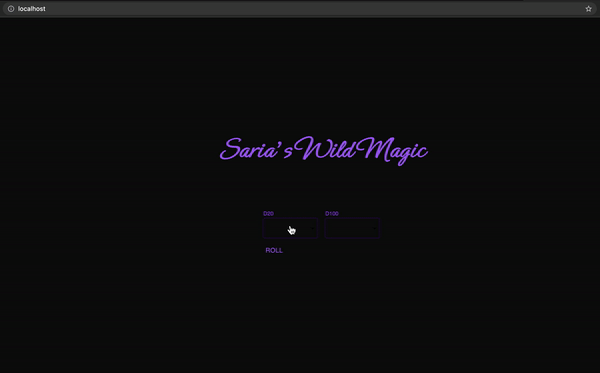

The API scrapes the table [here](https://www.dandwiki.com/wiki/Wild_Magic_Surge_Table,_Variant_(5e_Variant_Rule)) and stores the data in memory to serve back in JSON.

API example:

Request:
```
GET /roll/<int:d20>/<int:d100>
```

Response:
```
{'affect': 'This is the affect response'}
```

## Quick App Demo



## Installation

Requirements

- Docker
- Git

1. clone the repository
2. run the following
```
git submodule update --init
docker-compose build
docker-compose up -d
```
3. open a webbrowser and navigate to [http://localhost](http://localhost)

To stop the docker services run `docker-compose down`.
